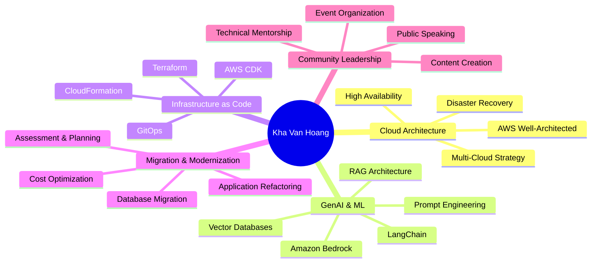

<div align="center">

<!-- Animated Typing Header -->
<a href="https://git.io/typing-svg"></a>

<h1>👋 Hi, I'm Kha Van Hoang</h1>

[](https://cloudjourney.awsstudygroup.com)
[](https://linkedin.com/in/vanhoangkha)
[](https://twitter.com/WorkKhavan)
[](https://facebook.com/kyairis)

<p><i>"Transforming enterprise cloud strategies into measurable business outcomes"</i></p>

</div>

---

## 🚀 About Me

🌟 **Cloud Solutions Architect** passionate about AWS, GenAI, and helping enterprises transform their cloud infrastructure

🏆 **AWS APJ Community Leaders 2024 Winner** - Leading 45,000+ community members across Asia-Pacific

💡 **5+ years** of enterprise consulting across Banking, FMCG, Manufacturing, and Public Sector

📊 **55+ AWS solutions** delivered with proven results: 60% cost reduction, 99.99% uptime

🎯 **10+ migration programs** handling 100+ workloads and 50TB+ data

🎤 **AWS re:Invent Speaker** & **AWS Community Day Vietnam 2025 Host**

📝 **5M+ technical blog reads** - Sharing knowledge and best practices

---

## 💼 Professional Highlights

```typescript
const khaVanHoang = {
    role: "Cloud Solutions Architect",
    location: "Ho Chi Minh City, Vietnam 🇻🇳",

    expertise: {
        cloud: ["AWS", "Multi-Cloud Architecture", "Well-Architected Framework"],
        genAI: ["Amazon Bedrock", "RAG", "LangChain", "Vector Databases"],
        iac: ["Terraform", "CloudFormation", "AWS CDK"],
        containers: ["Kubernetes", "EKS", "Docker", "ECS"],
        databases: ["DynamoDB", "RDS", "Aurora", "OpenSearch"],
        monitoring: ["CloudWatch", "X-Ray", "Grafana", "Prometheus"]
    },

    certifications: [
        "AWS Solutions Architect Professional",
        "AWS DevOps Engineer Professional",
        "AWS Security Specialty",
        "AWS Machine Learning Specialty"
    ],

    achievements: {
        communityLeadership: "AWS APJ Community Leaders 2024",
        communitySize: "45,000+ members",
        solutionsDelivered: "55+",
        migrationPrograms: "10+",
        blogReads: "5M+",
        repoStars: "500+ (AWS-First-GenAI-Journey)"
    },

    currentFocus: ["GenAI with Amazon Bedrock", "Enterprise Cloud Migration", "Community Building"],

    funFacts: [
        "🎙️ Regular speaker at AWS events",
        "📚 Created comprehensive learning resources for 45K+ learners",
        "🌏 Organizing AWS Community Day Vietnam 2025 (1,500+ expected attendees)",
        "💭 I may be slow to respond (building awesome stuff!)"
    ]
};
```

---

## 🛠️ Tech Stack

<div align="center">

### Cloud & Infrastructure


### GenAI & ML


### Databases


### Monitoring & Observability


### Languages & Tools


</div>

---

## 📊 GitHub Statistics

<div align="center">


</div>

<div align="center">

[](https://git.io/streak-stats)

</div>

<div align="center">

[](https://github.com/ryo-ma/github-profile-trophy)

</div>

---

## 🏆 Key Achievements & Impact

<table>
<tr>
<td width="50%">

### 🌟 Community Leadership
- 🏅 **AWS APJ Community Leaders 2024 Winner**
- 👥 **45,000+ active community members**
- 📚 **Primary learning resource for AWS in APAC**
- 🎤 **Regular speaker at AWS events**
- 🌏 **Organizing AWS Community Day Vietnam 2025**

</td>
<td width="50%">

### 💼 Enterprise Impact
- 📊 **55+ AWS solutions delivered**
- 💰 **60% average cost reduction**
- ⚡ **99.99% uptime achieved**
- 🔄 **10+ migration programs completed**
- 💾 **100+ workloads, 50TB+ data migrated**

</td>
</tr>
<tr>
<td width="50%">

### 🚀 Open Source Contributions
- ⭐ **500+ stars** on AWS-First-GenAI-Journey
- 📖 **Comprehensive learning resources**
- 🔧 **Production-ready reference architectures**
- 🤝 **Active maintainer** of community projects

</td>
<td width="50%">

### 📝 Content & Education
- 📰 **5M+ technical blog reads**
- 📹 **Video tutorials and workshops**
- 🎓 **Enabling job placements** across AWS partners
- 💡 **Best practices documentation**

</td>
</tr>
</table>

---

## 🎯 Featured Projects

<div align="center">

[](https://github.com/aws-samples/AWS-First-GenAI-Journey)
[](https://github.com/vanhoangkha/AWS-First-Cloud-Journey)

</div>

### 🌟 AWS-First-GenAI-Journey
Comprehensive resource for exploring generative AI capabilities with Amazon Bedrock
- ⭐ **500+ stars** from the community
- 🏗️ **Production-ready reference architectures**
- 📚 **End-to-end implementation guides**
- 🎯 **RAG, Agents, Guardrails, and more**

### 📘 AWS-First-Cloud-Journey
Primary learning resource enabling 45K+ community members to master AWS
- 🎓 **Structured learning paths**
- 💼 **Job placement enablement** across AWS partner organizations
- 🔧 **Hands-on labs and exercises**
- 📊 **Real-world use cases and patterns**

---

## 🎨 Portfolio Website

<div align="center">


</div>

### 🚀 Full-Stack Serverless Portfolio v2.0
A production-ready showcase of cloud architecture, AI/ML, and DevSecOps expertise built with modern AWS technologies.

**Tech Stack & Architecture:**
- 🏗️ **Monorepo Architecture** - International standard project structure
- ☁️ **AWS Amplify Gen 2** - Full-stack serverless deployment
- 🎨 **Modern Frontend** - Responsive, accessible, performance-optimized
- 🔧 **Infrastructure as Code** - AWS CDK & Amplify
- 🤖 **AI-Powered Features** - Amazon Bedrock integration
- 📊 **Real-time Analytics** - CloudWatch & custom dashboards
- 🔒 **Enterprise Security** - AWS IAM, Cognito, best practices
- 🚀 **CI/CD Pipeline** - Automated testing & deployment

**Highlights:**
- 💼 Showcase of 55+ enterprise solutions and case studies
- 🏆 Interactive demonstrations of AWS architecture patterns
- 📚 Technical blog integration with 5M+ reads
- 🎯 GenAI projects and Bedrock implementations
- 📈 Performance metrics and cost optimization insights

**Coming Soon:** Live portfolio website will be available soon! 🎉

---

## 🎤 Speaking & Events

<div align="center">

| Event | Role | Year | Audience |
|-------|------|------|----------|
| AWS re:Invent | Speaker | 2024 | Global |
| AWS Community Day Vietnam | Host & Organizer | 2025 | 1,500+ |
| AWS Summit Online ASEAN | Speaker | 2024 | Regional |
| Various AWS Meetups | Regular Speaker | 2020-2025 | Local |

</div>

---

## 📝 Latest Blog Posts

<!-- BLOG-POST-LIST:START -->
🔗 Visit [cloudjourney.awsstudygroup.com](https://cloudjourney.awsstudygroup.com) for the latest articles on:
- 🤖 GenAI and Amazon Bedrock best practices
- ☁️ AWS architecture patterns and solutions
- 🔧 Infrastructure as Code with Terraform
- 🚀 Cloud migration strategies
- 💡 Cost optimization techniques
<!-- BLOG-POST-LIST:END -->

---

## 💡 Areas of Expertise



---

## 🤝 Let's Connect!

<div align="center">

I'm always happy to connect with fellow cloud enthusiasts, developers, and architects!

[](https://cloudjourney.awsstudygroup.com)
[](https://linkedin.com/in/vanhoangkha)
[](https://twitter.com/WorkKhavan)
[](https://facebook.com/kyairis)
[](mailto:khavan.work@gmail.com)

### 📫 How to reach me:
- 💼 LinkedIn: [linkedin.com/in/vanhoangkha](https://linkedin.com/in/vanhoangkha)
- 🐦 Twitter: [@WorkKhavan](https://twitter.com/WorkKhavan)
- 🌐 Website: [cloudjourney.awsstudygroup.com](https://cloudjourney.awsstudygroup.com)
- 📧 Email: khavan.work@gmail.com

### 💭 Current Status
> "I may be slow to respond - building awesome cloud solutions and growing the AWS community! 🚀"

</div>

---

## 📈 Contribution Activity

<div align="center">

[](https://github.com/vanhoangkha)

</div>

---

## 🎯 Goals for 2025

- [ ] 🎨 Launch production-ready portfolio website with AWS Amplify
- [ ] 🌟 Grow AWS community to 60,000+ members
- [ ] 🎤 Speak at 10+ international AWS events
- [ ] 📚 Publish comprehensive GenAI course
- [ ] 🏆 Achieve AWS Ambassador status
- [ ] 🤝 Help 1,000+ developers get AWS certified
- [ ] 🚀 Launch 5+ major open-source projects
- [ ] 🌏 Make AWS Community Day Vietnam the largest in SEA

---

<div align="center">

### 💖 Thank you for visiting!


**If you find my work helpful, consider:**
- ⭐ Starring my repositories
- 🐛 Reporting issues or suggesting improvements
- 🤝 Contributing to open-source projects
- 📢 Sharing with your network

<p><i>"The cloud is not a place, it's a way of doing IT"</i></p>

**Let's build something amazing together! 🚀**

</div>

---

<div align="center">

[](https://github.com/vanhoangkha)

</div>
