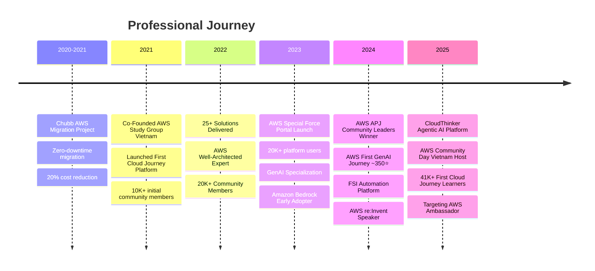
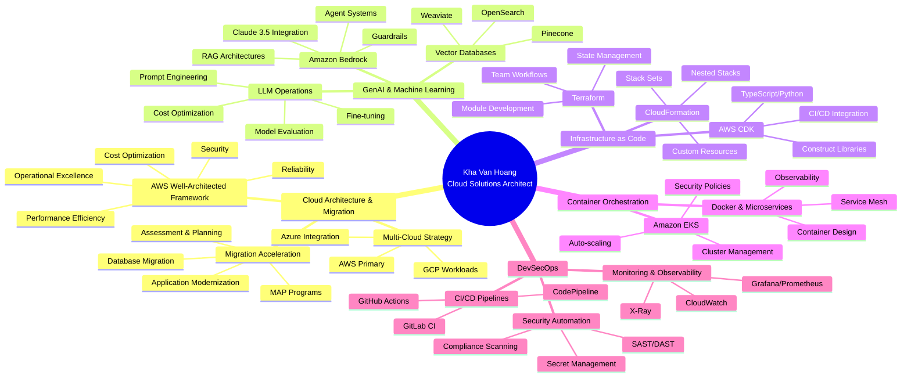

<!-- Professional Header with Wave Animation -->
<div align="center">
  
</div>

<!-- Animated Typing Effect -->
<div align="center">
  <a href="https://git.io/typing-svg">
    
  </a>
</div>

<!-- Profile Views & Social Badges -->
<div align="center">

  
  
  

  [](https://cloudjourney.awsstudygroup.com)
  [](https://linkedin.com/in/vanhoangkha)
  [](https://twitter.com/WorkKhavan)
  [](mailto:khavan.work@gmail.com)

</div>

<div align="center">

  ### 💼 *"Transforming enterprise cloud strategies into measurable business outcomes"*

</div>

<br/>

<!-- Snake Animation -->
<div align="center">
  <picture>
    <source media="(prefers-color-scheme: dark)" srcset="https://raw.githubusercontent.com/vanhoangkha/vanhoangkha/output/github-contribution-grid-snake-dark.svg">
    <source media="(prefers-color-scheme: light)" srcset="https://raw.githubusercontent.com/vanhoangkha/vanhoangkha/output/github-contribution-grid-snake.svg">
    
  </picture>
</div>

<br/>

---

## 🎯 Quick Overview

<table>
  <tr>
    <td width="50%" valign="top">

### 👨‍💼 Professional Profile
```yaml
role: Cloud Solutions Architect
location: Ho Chi Minh City, Vietnam 🇻🇳
experience: 5+ years
specialization: AWS, GenAI, Enterprise Architecture

community:
  leadership: AWS APJ Community Leaders 2024
  members: 45,000+ (AWS Study Group Vietnam)
  learners: 41,000+ (First Cloud Journey Platform)
  mentors: 150+ expert contributors
  content_reach: 5M+ blog reads
  repo_stars: 350+ (AWS-First-GenAI-Journey)

platforms:
  first_cloud_journey: 41K+ learners, 150+ mentors
  cloudthinker: Agentic AI Platform (2025)
  special_force: 20K+ users
  fsi_automation: 40% efficiency gain

achievements:
  solutions_delivered: 55+
  cost_reduction: 60% average
  uptime: 99.99%
  migrations: 10+ programs (100+ workloads, 50TB data)
  roi: $120K+ annual per engagement
```

</td>
<td width="50%" valign="top">

### 🏆 Awards & Recognition
- 🥇 **AWS APJ Community Leaders 2024 Winner**
- 🎤 **AWS re:Invent Speaker (2024)**
- 🌏 **AWS Community Day Vietnam 2025 Host**
- 📊 **Top AWS Content Creator (5M+ reads)**
- ⭐ **350+ GitHub Stars (AWS First GenAI Journey)**
- 🚀 **7 Major Platforms & Open Source Projects**

### 🎓 Current Focus
- 🤖 **CloudThinker** - Agentic AI Platform Development
- 💰 **FSI Automation** - Financial Services Intelligence
- ☁️ Enterprise Cloud Migration & Modernization
- 🌟 AWS Study Group Vietnam (45K+ members)
- 📚 First Cloud Journey Platform (41K+ learners)
- 🎨 Portfolio Website Development (AWS Amplify)

</td>
  </tr>
</table>

---

## 📜 AWS Certifications

<div align="center">

### ✨ Professional Level Certifications

<table>
  <tr>
    <td align="center" width="25%">
      
      <br/><b>Solutions Architect</b>
      <br/><b>Professional</b>
    </td>
    <td align="center" width="25%">
      
      <br/><b>DevOps Engineer</b>
      <br/><b>Professional</b>
    </td>
    <td align="center" width="25%">
      
      <br/><b>Security</b>
      <br/><b>Specialty</b>
    </td>
    <td align="center" width="25%">
      
      <br/><b>Machine Learning</b>
      <br/><b>Specialty</b>
    </td>
  </tr>
</table>

**🎯 Mastery in:** Solutions Architecture • DevOps Automation • Security & Compliance • AI/ML Implementation

</div>

---

## 💼 Career Timeline



---

## 🛠️ Technology Stack & Expertise

<div align="center">

### ☁️ Cloud & Infrastructure


### 🤖 GenAI & Machine Learning


### 💾 Databases & Storage


### 📊 Monitoring & Observability


### 🔐 Security & Compliance


### 💻 Programming & Scripting


### 🚀 CI/CD & DevOps


</div>

---

## 📊 GitHub Analytics & Statistics

<div align="center">

### 📈 Overall Performance


### 🔥 Contribution Streak

[](https://git.io/streak-stats)

### 🏆 GitHub Trophies

[](https://github.com/ryo-ma/github-profile-trophy)

### 📊 Contribution Graph

[](https://github.com/vanhoangkha)

</div>

---

## 💼 Enterprise Impact & Measurable Results

<div align="center">

### 📈 Key Performance Metrics

<table>
  <tr>
    <td align="center" width="25%">
      
      <br/><b>Delivered</b>
    </td>
    <td align="center" width="25%">
      
      <br/><b>Average</b>
    </td>
    <td align="center" width="25%">
      
      <br/><b>Achieved</b>
    </td>
    <td align="center" width="25%">
      
      <br/><b>Annual</b>
    </td>
  </tr>
  <tr>
    <td align="center" width="25%">
      
      <br/><b>Programs</b>
    </td>
    <td align="center" width="25%">
      
      <br/><b>Migrated</b>
    </td>
    <td align="center" width="25%">
      
      <br/><b>Transferred</b>
    </td>
    <td align="center" width="25%">
      
      <br/><b>Members</b>
    </td>
  </tr>
</table>

</div>

### 🎯 Industry Expertise

<table>
<tr>
<td width="50%">

#### 🏦 Banking & Financial Services
- 💳 Core banking system migration to AWS
- 🔒 Real-time fraud detection with ML
- 🛡️ PCI-DSS compliant infrastructure
- ⚡ 99.99% uptime SLA achievement
- 📊 Risk analytics and compliance automation

#### 🏭 Manufacturing
- 🔧 IoT data pipeline on AWS
- 🤖 Predictive maintenance with AI/ML
- 📦 Supply chain optimization
- 💰 40% operational cost reduction
- 📈 Real-time production monitoring

</td>
<td width="50%">

#### 🛒 FMCG & Retail
- 🛍️ E-commerce platform on AWS
- 📦 Inventory management with ML
- ⚡ Serverless order processing
- 💰 60% infrastructure cost savings
- 📊 Real-time sales analytics
- 🤖 AI-powered demand forecasting

#### 🏛️ Public Sector
- 🌐 Government portal modernization
- 🔒 Secure data lake implementation
- ✅ Compliance with local regulations
- 📉 50% support ticket reduction with GenAI
- 🤖 AI-powered citizen services
- 🛡️ Advanced security and governance

</td>
</tr>
</table>

---

## 🚀 Featured Platforms & Major Projects

<div align="center">

### ⭐ Flagship Repositories

[](https://github.com/aws-samples/AWS-First-GenAI-Journey)
[](https://github.com/vanhoangkha/AWS-First-Cloud-Journey)

</div>

---

### 🌟 1. First Cloud Journey Platform (2021-Present)
**🌐 [cloudjourney.awsstudygroup.com](https://cloudjourney.awsstudygroup.com)**

The largest AWS learning platform in Southeast Asia, providing comprehensive cloud education from fundamentals to advanced topics.

**📊 Impact Metrics:**
- 🎓 **41,000+** active learners across APAC region
- 👨‍🏫 **150+** expert mentors and contributors
- 📚 **500+** structured learning modules
- 🏆 **5,000+** AWS certifications achieved
- 💼 **1,000+** job placements enabled

**🎯 Key Features:**
- 📝 Complete AWS certification preparation paths
- 🔬 Hands-on labs with real AWS services
- 🏗️ Well-Architected Framework implementations
- 🌏 Vietnamese and English bilingual content
- 🤝 Integration with AWS Study Group community
- 🎥 Video tutorials and live coding sessions
- 💬 Q&A forums and peer learning

**🚀 Technologies:** AWS Amplify, DynamoDB, CloudFront, Cognito, Lambda

---

### 🤖 2. CloudThinker - Agentic AI Platform (2025-Present)
**🌐 [cloudthinker.io](https://cloudthinker.io) | 📦 [github.com/strands-agents](https://github.com/strands-agents)**

Next-generation agentic AI platform enabling intelligent automation for complex data workflows with Amazon Bedrock.

**📊 Impact Metrics:**
- ⚡ **35-40%** efficiency improvement in data workflows
- 🤖 Multi-agent orchestration with Claude 3.5 Sonnet
- 📈 Processing 100,000+ documents per month
- 🔄 Real-time collaboration between AI agents

**🎯 Key Features:**
- 🧠 Autonomous AI agents for data analysis
- 🤝 Multi-agent collaboration framework
- 🔗 Integration with Amazon Bedrock
- ⚡ Real-time streaming and orchestration
- 🔐 Enterprise-grade security and compliance
- 📊 Advanced analytics and insights
- 🎯 Task automation and workflow optimization

**🚀 Technologies:** Amazon Bedrock, LangChain, AWS Step Functions, DynamoDB Streams

---

### 💰 3. Financial Services Intelligence (FSI) Automation (2024-Present)
**📦 [github.com/vanhoangkha/Financial-Services-Intelligence-Automation](https://github.com/vanhoangkha/Financial-Services-Intelligence-Automation)**

AI-powered financial document processing and audit automation platform for banking and insurance sectors.

**📊 Impact Metrics:**
- 📉 **40%** reduction in manual audit effort
- 🎯 **95%** accuracy in document classification
- ⚡ **10x** faster compliance reporting
- 💰 **$500K+** annual cost savings per organization

**🎯 Key Features:**
- 📄 Intelligent document understanding with Amazon Bedrock
- ✅ Automated compliance checking and reporting
- 🚨 Real-time fraud detection patterns
- 🌐 Multi-language support (English, Vietnamese)
- 📋 Regulatory compliance (Basel III, IFRS)
- 🔍 Advanced OCR and data extraction
- 📊 Risk assessment and scoring

**🚀 Technologies:** Amazon Bedrock, Textract, Comprehend, Lambda, Step Functions

---

### 🏢 4. Chubb AWS Migration Program (2020-2021)
**📦 [github.com/vanhoangkha/chubb-aws-migration](https://github.com/vanhoangkha/chubb-aws-migration)**

Enterprise-scale cloud migration for Chubb Life Insurance, transforming legacy infrastructure to modern AWS architecture.

**📊 Impact Metrics:**
- ✅ **Zero-downtime** migration of critical systems
- 💰 **20%** infrastructure cost reduction
- 🔒 Enhanced security posture with AWS native services
- ⚡ **3x** improvement in application performance
- 📈 **99.99%** uptime SLA achievement

**🎯 Scope:**
- 📦 **50+ applications** migrated to AWS
- 💾 **25TB+ data** transferred securely
- 🌍 Multi-region disaster recovery setup
- 🛡️ PCI-DSS and SOC2 compliance maintained
- 🔄 Zero-downtime cutover strategy
- 👥 Cross-functional team coordination

**🚀 Technologies:** AWS Migration Hub, Database Migration Service, Application Migration Service

---

### 🤖 5. AWS First GenAI Journey - Open Source Contributor
**⭐ ~350 Stars | 📦 [aws-samples/AWS-First-GenAI-Journey](https://github.com/aws-samples/AWS-First-GenAI-Journey)**

Comprehensive resource for building production-ready generative AI applications with Amazon Bedrock.

**📊 Impact Metrics:**
- ⭐ **350+** GitHub stars
- 🍴 **100+** forks
- 📚 **20+** implementation guides
- 👥 **1,000+** developers enabled
- 📖 Featured in AWS official documentation

**🎯 Key Contributions:**
- 🏗️ RAG architecture implementation patterns
- 🤖 Multi-agent system designs
- 🛡️ Guardrails and safety implementations
- 💰 Cost optimization strategies
- 🚀 Production deployment guides
- 📖 Comprehensive documentation
- 🎓 Step-by-step tutorials

**🚀 Technologies:** Amazon Bedrock, LangChain, OpenSearch, DynamoDB

---

### 🌏 6. AWS Study Group Vietnam (2021-Present)
**🌐 [awsstudygroup.com](https://awsstudygroup.com)**

Co-founded and lead the largest AWS community in Vietnam, fostering cloud adoption and career development.

**📊 Impact Metrics:**
- 👥 **45,000+** active community members
- 🎓 **200+** workshops and technical sessions
- 👨‍🏫 **100+** engineers personally mentored
- 🏆 **5,000+** AWS certifications achieved
- 🌟 Recognized as **AWS Community Leaders 2024**

**🎯 Community Activities:**
- 📅 Weekly technical meetups and workshops
- 🏗️ Monthly AWS architecture reviews
- 🏆 Quarterly hackathons and competitions
- 🎓 Certification study groups
- 💼 Job placement assistance
- 🎤 Guest speaker sessions
- 🌟 Community recognition programs

**🚀 Programs:** First Cloud Journey, Special Force Portal, Community Day Vietnam

---

### 🚀 7. AWS Special Force Portal (2023-Present)
**🌐 [specialforce.awsstudygroup.com](https://specialforce.awsstudygroup.com)**

Internal platform for AWS Study Group community, providing advanced learning resources and collaboration tools.

**📊 Impact Metrics:**
- 👤 **20,000+** registered users
- 📚 **1,000+** advanced technical resources
- 🎯 **500+** expert-level certifications
- 🤝 Facilitates mentorship connections
- 💼 Career advancement tracking

**🎯 Key Features:**
- 🎓 Advanced AWS certification preparation
- 👥 Expert mentorship program matching
- 🏅 Technical challenge competitions
- 📈 Career progression tracking
- ⭐ Community contribution recognition
- 🎯 Personalized learning paths
- 💬 Peer-to-peer knowledge sharing

**🚀 Technologies:** AWS Amplify Gen 2, AppSync, DynamoDB, Cognito, Lambda

---

## 🎨 Portfolio Website - Coming Soon

<div align="center">


</div>

### 🚀 Full-Stack Serverless Portfolio v2.0

<table>
<tr>
<td width="50%">

#### 🏗️ Architecture & Infrastructure
- 📦 **Monorepo Structure** - International standard organization
- ⚡ **AWS Amplify Gen 2** - Full-stack serverless platform
- 🛠️ **Infrastructure as Code** - AWS CDK & Amplify CLI
- 🚀 **CI/CD Pipeline** - Automated testing & deployment
- 🌍 **Multi-Environment** - Dev, staging, production
- 🔐 **Security First** - Best practices implementation

#### 🤖 AI-Powered Features
- 💬 **Amazon Bedrock Integration** - AI chatbot assistance
- ✍️ **Content Generation** - Automated case study summaries
- 🔍 **Semantic Search** - Find relevant projects instantly
- 🎯 **Personalization** - ML-powered recommendations
- 🧠 **Smart Analytics** - AI-driven insights
- 🌐 **Multi-language Support** - Global accessibility

</td>
<td width="50%">

#### 🎨 Frontend Excellence
- 📱 **Responsive Design** - Mobile-first approach
- ⚡ **Performance Optimized** - Core Web Vitals optimized
- ♿ **Accessibility** - WCAG 2.1 AA compliant
- 🎭 **Modern UX** - Smooth animations & transitions
- 🌓 **Dark Mode** - User preference support
- 🎨 **Design System** - Consistent UI components

#### 📊 Analytics & Insights
- 📈 **Real-time Dashboards** - CloudWatch integration
- 🎯 **Performance Metrics** - Custom business KPIs
- 👥 **Visitor Analytics** - Privacy-focused tracking
- 💰 **Cost Optimization** - FinOps implementation
- 📉 **Error Monitoring** - Proactive issue detection
- 🔔 **Smart Alerts** - Automated notifications

</td>
</tr>
</table>

**📦 Showcase Content:**
- 💼 55+ enterprise solutions with detailed case studies
- 🏆 Interactive AWS architecture pattern demonstrations
- 📚 5M+ blog posts integration and search
- 🎯 GenAI projects and Amazon Bedrock implementations
- 📈 Performance metrics and cost optimization insights
- 🎓 Certification journey and learning resources

**🎉 Launch Timeline:** Q1 2025

---

## 🎤 Speaking Engagements & Community Events

<div align="center">

### 🌟 Major Events & Conferences

<table>
  <tr>
    <th>Event</th>
    <th>Role</th>
    <th>Year</th>
    <th>Audience</th>
    <th>Topics</th>
  </tr>
  <tr>
    <td>🌎 <b>AWS re:Invent</b></td>
    <td>Speaker</td>
    <td>2024</td>
    <td>Global</td>
    <td>GenAI, Bedrock, Community Building</td>
  </tr>
  <tr>
    <td>🇻🇳 <b>AWS Community Day Vietnam</b></td>
    <td>Host & Organizer</td>
    <td>2025</td>
    <td>1,500+</td>
    <td>Full-day conference organization</td>
  </tr>
  <tr>
    <td>🌏 <b>AWS Summit Online ASEAN</b></td>
    <td>Speaker</td>
    <td>2024</td>
    <td>Regional</td>
    <td>Cloud Migration, Cost Optimization</td>
  </tr>
  <tr>
    <td>📍 <b>AWS User Group Meetups</b></td>
    <td>Regular Speaker</td>
    <td>2020-2025</td>
    <td>100-500</td>
    <td>Architecture, GenAI, Best Practices</td>
  </tr>
</table>

### 🎓 Workshop & Training Sessions

- 🏗️ **Enterprise Cloud Architecture Workshop** - 8+ sessions, 500+ participants
- 🤖 **GenAI with Amazon Bedrock** - Hands-on training series
- 📐 **AWS Well-Architected Framework** - Deep-dive sessions
- 💰 **Cost Optimization Strategies** - Executive briefings
- 🔐 **Security Best Practices** - Hands-on labs
- 🚀 **DevOps & CI/CD** - Modern deployment patterns

</div>

---

## 📝 Publications & Content

<div align="center">

### ✍️ Technical Blog

[](https://cloudjourney.awsstudygroup.com)

**📰 Featured Series:**
- 🤖 **GenAI & Amazon Bedrock** - Production implementation guides
- ☁️ **AWS Architecture Patterns** - Well-Architected solutions
- 🔧 **Infrastructure as Code** - Terraform & CloudFormation deep-dives
- 🚀 **Migration Strategies** - Real-world case studies
- 💰 **Cost Optimization** - FinOps best practices
- 🔒 **Security & Compliance** - Enterprise-grade implementations

**📊 Content Impact:**
- 5,000,000+ total reads
- 10,000+ monthly active readers
- Top 1% AWS content creator
- Featured in AWS official newsletters

</div>

### 📚 Notable Articles

<table>
<tr>
<td width="50%">

1. **Building Production RAG Systems with Amazon Bedrock**
   - 50K+ reads | Advanced implementation guide

2. **AWS Cost Optimization: 60% Reduction Strategy**
   - 40K+ reads | Real enterprise case study

3. **Migrating 100+ Workloads to AWS: Lessons Learned**
   - 35K+ reads | Migration acceleration program

</td>
<td width="50%">

4. **GenAI Agents with Amazon Bedrock: Complete Guide**
   - 45K+ reads | Multi-agent systems

5. **AWS Well-Architected: 5 Pillars in Practice**
   - 30K+ reads | Framework implementation

6. **Terraform Best Practices for Enterprise AWS**
   - 25K+ reads | IaC at scale

</td>
</tr>
</table>

---

## 🎓 Community Leadership & Education

<div align="center">

### 🌟 AWS Community Leadership


</div>

### 👥 Community Impact

<table>
<tr>
<td width="50%">

#### 📊 Quantitative Metrics
- 👥 **45,000+** active community members
- 🎓 **5,000+** engineers upskilled
- 💼 **1,000+** job placements enabled
- 🏆 **500+** AWS certifications achieved
- 📈 **5M+** content reach (articles, videos, posts)
- 🎉 **100+** community events organized
- 🌟 **50+** technical workshops delivered

</td>
<td width="50%">

#### 🎯 Qualitative Impact
- 🌏 Primary AWS learning resource in APAC
- 🚀 Enabler for career transitions to cloud
- 🌉 Bridge between AWS and local communities
- 👨‍🏫 Mentor for 100+ aspiring architects
- 📣 Advocate for cloud adoption in enterprises
- 🌈 Champion of diversity in tech
- 🤝 Building collaborative tech ecosystems

</td>
</tr>
</table>

### 🏆 Recognition & Awards

- 🥇 **AWS APJ Community Leaders 2024** - Top community contributor in Asia-Pacific
- 🌟 **AWS Community Builder** - Multi-year program member
- 📝 **Top AWS Content Creator** - 5M+ reads, featured by AWS
- 🎤 **AWS re:Invent Speaker** - Selected to speak at premier AWS conference
- 🌏 **Regional Community Leader** - Largest AWS community in Vietnam

---

## 💡 Areas of Deep Expertise



---

## 🤝 Let's Connect & Collaborate!

<div align="center">

### 💼 Professional Networks

[](https://cloudjourney.awsstudygroup.com)
[](https://linkedin.com/in/vanhoangkha)
[](https://twitter.com/WorkKhavan)
[](https://facebook.com/kyairis)
[](mailto:khavan.work@gmail.com)

### 🎯 Open For

<table>
  <tr>
    <td align="center" width="25%">
      
      <br/><b>Consulting</b>
      <br/>Enterprise cloud architecture
    </td>
    <td align="center" width="25%">
      
      <br/><b>Speaking</b>
      <br/>Conferences & workshops
    </td>
    <td align="center" width="25%">
      
      <br/><b>Mentoring</b>
      <br/>Career guidance & upskilling
    </td>
    <td align="center" width="25%">
      
      <br/><b>Collaboration</b>
      <br/>Open source & content
    </td>
  </tr>
</table>

### 📬 Contact Information

- 💼 **LinkedIn:** [linkedin.com/in/vanhoangkha](https://linkedin.com/in/vanhoangkha)
- 🐦 **Twitter:** [@WorkKhavan](https://twitter.com/WorkKhavan)
- 🌐 **Website:** [cloudjourney.awsstudygroup.com](https://cloudjourney.awsstudygroup.com)
- 📧 **Email:** khavan.work@gmail.com
- 📍 **Location:** Ho Chi Minh City, Vietnam 🇻🇳
- ⏰ **Timezone:** GMT+7 (ICT)

### 💬 Response Time

> 💭 *"I may be slow to respond - currently building awesome cloud solutions, growing the AWS community, and preparing for AWS Community Day Vietnam 2025! I read every message and will get back to you as soon as possible. For urgent matters, please connect via LinkedIn."*

</div>

---

## 🎯 Goals & Vision for 2025

<div align="center">

### 🚀 Strategic Objectives

</div>

<table>
<tr>
<td width="50%">

### 🌟 Community & Content
- [ ] **60,000+ Community Members** - Grow AWS community by 33%
- [ ] **Publish Comprehensive GenAI Course** - Free certification course
- [ ] **10+ International Speaking Events** - AWS Summit, re:Invent, regional conferences
- [ ] **Launch 5+ Major Open Source Projects** - Production-ready solutions
- [ ] **🎨 Production Portfolio Website** - AWS Amplify showcase

</td>
<td width="50%">

### 🏆 Professional Development
- [ ] **AWS Ambassador Status** - Top-tier AWS recognition
- [ ] **1,000+ Developers AWS Certified** - Certification enablement program
- [ ] **Largest AWS Community Day SEA** - 2,000+ attendees target
- [ ] **Enterprise GenAI Consulting** - 20+ Bedrock implementations
- [ ] **Thought Leadership** - Industry recognition

</td>
</tr>
</table>

### 🎯 Long-term Vision (2025-2027)

- 🌏 **Regional Impact:** Lead AWS adoption across Southeast Asia
- 🎓 **Education Platform:** Launch comprehensive cloud learning platform
- 💼 **Consulting Practice:** Establish boutique AWS consulting firm
- 📚 **Publish Book:** "Enterprise GenAI with Amazon Bedrock"
- 🤝 **Strategic Partnerships:** Collaborate with AWS on community programs

---

## 📊 Professional Metrics Dashboard

<div align="center">

### 📈 2024 Achievements Recap

<table>
  <tr>
    <td align="center"><br/><b>Delivered</b></td>
    <td align="center"><br/><b>Average</b></td>
    <td align="center"><br/><b>Members</b></td>
    <td align="center"><br/><b>Reads</b></td>
    <td align="center"><br/><b>Speaking</b></td>
  </tr>
</table>

### 🎖️ Badges & Recognition


</div>

---

<div align="center">

### 💖 Thank You for Visiting!


**💡 If you find my work valuable, consider:**

🌟 **Starring my repositories** • 🤝 **Contributing to open source** • 📢 **Sharing with your network**
💬 **Connecting on LinkedIn** • 🐛 **Reporting issues** • 💡 **Suggesting improvements**

---

### 🌟 *"The cloud is not a place, it's a way of doing IT"*

### 🚀 Let's Build Something Amazing Together!

---

[](https://github.com/vanhoangkha)
[](https://aws.amazon.com)
[](https://claude.ai)

</div>
