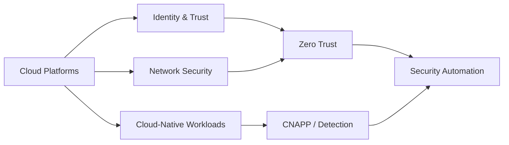

<p align="center">
  
</p>

<p align="center">
  <a href="https://cloudsecop.net"></a>
  <a href="https://www.linkedin.com/in/vanhoangkha/"></a>
  <a href="https://cloudjourney.awsstudygroup.com"></a>
  <a href="https://twitter.com/WorkKhavan"></a>
</p>

## Cloud Security Engineering

I work on security architecture and engineering across **AWS, Azure, GCP, Cloudflare, Huawei Cloud, and Yandex Cloud**, with a focus on identity, network security, cloud-native workloads, Zero Trust, and security automation.

My engineering approach is centered on **short-lived identity, least privilege, defense in depth, measurable security controls, and infrastructure as code**.

### Focus Areas

| Domain | Engineering focus |
| --- | --- |
| **Cloud Security Architecture** | Landing zones, shared security services, segmentation, centralized inspection, guardrails |
| **IAM & Workload Identity** | OIDC, federation, IAM Roles Anywhere, CIEM, ABAC, permission boundaries, short-lived credentials |
| **Zero Trust / SASE** | ZTNA, device posture, identity-aware access, policy enforcement, SIEM integration |
| **Kubernetes & Container Security** | EKS/Kubernetes hardening, workload identity, supply chain, runtime security, network policy |
| **CNAPP / CSPM / CWPP** | posture management, attack paths, exposure analysis, workload protection, cloud detection |
| **Cloud Network Security** | egress control, NGFW, WAF, VPC/VNet segmentation, Transit Gateway, hybrid networking |
| **DevSecOps / IaC Security** | Terraform, policy-as-code, CI security gates, secret scanning, SAST/SCA, automated validation |


```mermaid
flowchart LR
    A[Cloud Platforms] --> B[Identity & Trust]
    A --> C[Network Security]
    A --> D[Cloud-Native Workloads]
    B --> E[Zero Trust]
    C --> E
    D --> F[CNAPP / Detection]
    E --> G[Security Automation]
    F --> G
```

## Selected Engineering Work

### Security Architecture & IAM

| Project | What it demonstrates |
| --- | --- |
| [aws-security-patterns](https://github.com/vanhoangkha/aws-security-patterns) | AWS security reference architectures and reusable security patterns |
| [workload-identity-federation-guide](https://github.com/vanhoangkha/workload-identity-federation-guide) | Keyless cross-cloud authentication and workload identity federation |
| [aws-iam-accessadvisor-permissionboundary](https://github.com/vanhoangkha/aws-iam-accessadvisor-permissionboundary) | Least-privilege automation using Access Advisor and permission boundaries |
| [aws-iam-access-analyzer-solution](https://github.com/vanhoangkha/aws-iam-access-analyzer-solution) | External-access detection and IAM exposure analysis |

### Kubernetes, Containers & Cloud-Native Security

| Project | What it demonstrates |
| --- | --- |
| [container-security-series](https://github.com/vanhoangkha/container-security-series) | Container image security, runtime protection, Kubernetes hardening, supply-chain security and Zero Trust |
| [n8n-on-aws-eks](https://github.com/vanhoangkha/n8n-on-aws-eks) | Production-style Kubernetes deployment and AWS/EKS integration |
| [aws-eks-blueprints](https://github.com/vanhoangkha/aws-eks-blueprints) | EKS platform patterns and reusable cluster architecture |

### Security Platforms & Automation

| Project | What it demonstrates |
| --- | --- |
| [cloudsecop-platform-mvp](https://github.com/vanhoangkha/cloudsecop-platform-mvp) | Cloud security operations platform experimentation |
| [aws-iam-access-key-auto-rotation](https://github.com/vanhoangkha/aws-iam-access-key-auto-rotation) | IAM credential lifecycle automation and compliance controls |
| [aws-certification-prep-app](https://github.com/vanhoangkha/aws-certification-prep-app) | Full-stack AWS application and automation patterns |

## Open-Source Security Contributions

I contribute security research, tooling, and cloud hardening patterns upstream where possible.

- **Wiz Open Cloud Vulnerability Database** — contributions covering AWS, Azure, and GCP vulnerabilities, plus validation tooling.
- **Yandex Cloud Security Solutions Library** — VM metadata hardening and Terraform-based reference implementation.
- **Prowler ecosystem** — experimentation around security graph, attack paths, CIEM, CWPP, DSPM, and cloud detection capabilities.

## Security Engineering Principles

```text
Identity first
    ↓
Short-lived credentials
    ↓
Least privilege + explicit trust boundaries
    ↓
Network and workload segmentation
    ↓
Continuous posture and runtime visibility
    ↓
Detection, response and automated remediation
```

I prefer designs that are **auditable, reversible, automatable, and measurable** rather than relying on static credentials or manual operational controls.

## Writing & Research

Recent areas I write and experiment with:

- Workload identity and keyless authentication
- Zero Trust and Cloudflare One
- Kubernetes and container security
- IAM least privilege and cloud authorization
- CNAPP, attack paths, CSPM and workload protection
- Multi-cloud network security and centralized egress inspection
- AI-assisted cloud security operations

Technical notes and long-form posts: [cloudsecop.net](https://cloudsecop.net)

## Certifications & Community

- **AWS Community Builder** — Security category
- **Leader**, AWS User Group Vietnam
- **Leader**, MongoDB User Group Vietnam
- **Organizer & speaker**, AWS Community Day Vietnam

<p>
  
  
  
  
  
  
</p>

## Community & Learning

| Project | Scope |
| --- | --- |
| [aws-first-cloud-journey](https://github.com/vanhoangkha/aws-first-cloud-journey) | Hands-on AWS learning path, workshops and certification resources |
| [aws-free-tier-optimization-guide](https://github.com/vanhoangkha/aws-free-tier-optimization-guide) | Practical AWS cost-optimization guide |
| [aws-community-event-handbook](https://github.com/vanhoangkha/aws-community-event-handbook) | Community event operating practices and reusable guidance |

## Technology

<p>
  
  
  
  
  
  
  
  
  
</p>

## Contact

- [LinkedIn](https://www.linkedin.com/in/vanhoangkha/)
- [cloudsecop.net](https://cloudsecop.net)
- [AWS First Cloud Journey](https://cloudjourney.awsstudygroup.com)
- [X / Twitter](https://twitter.com/WorkKhavan)

Open to collaboration on **cloud security engineering, workload identity, Zero Trust, Kubernetes security, cloud-native security platforms, and technical community initiatives**.

<p align="center">
  
</p>
